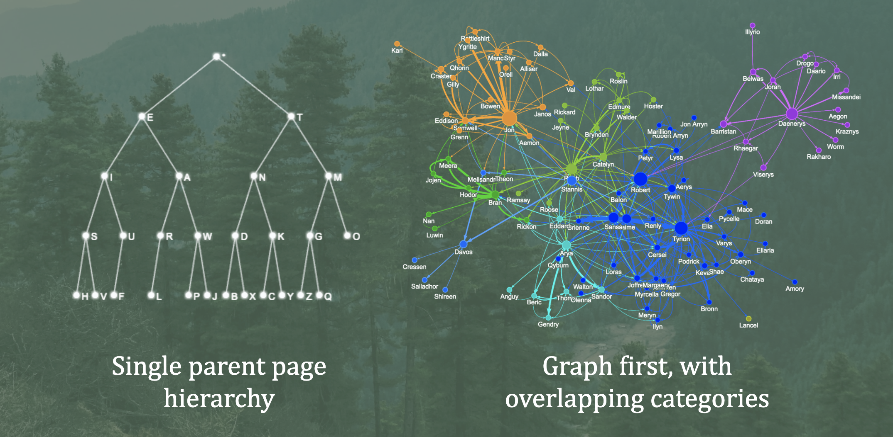
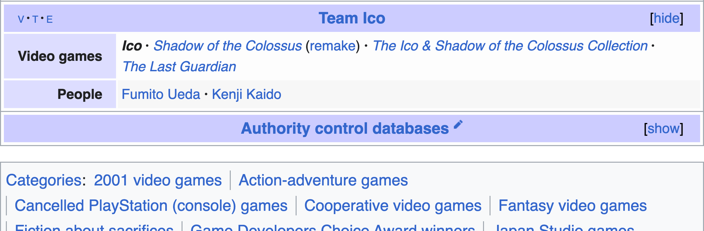
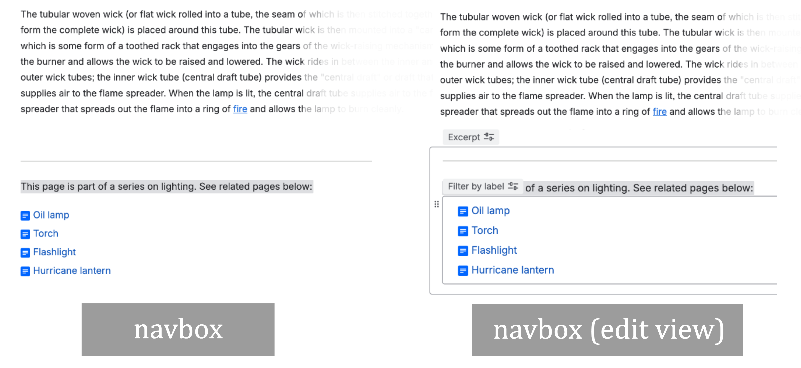
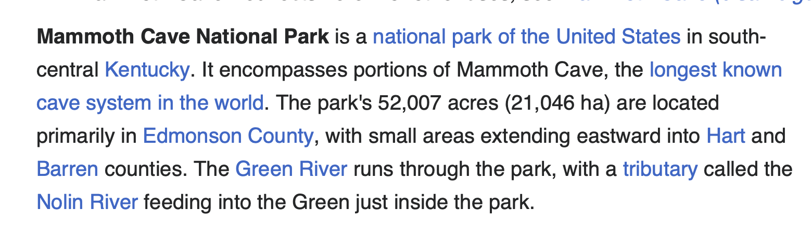
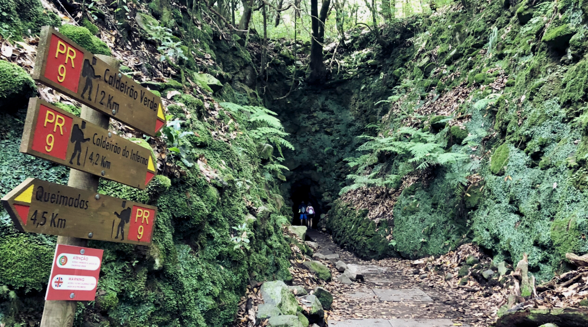
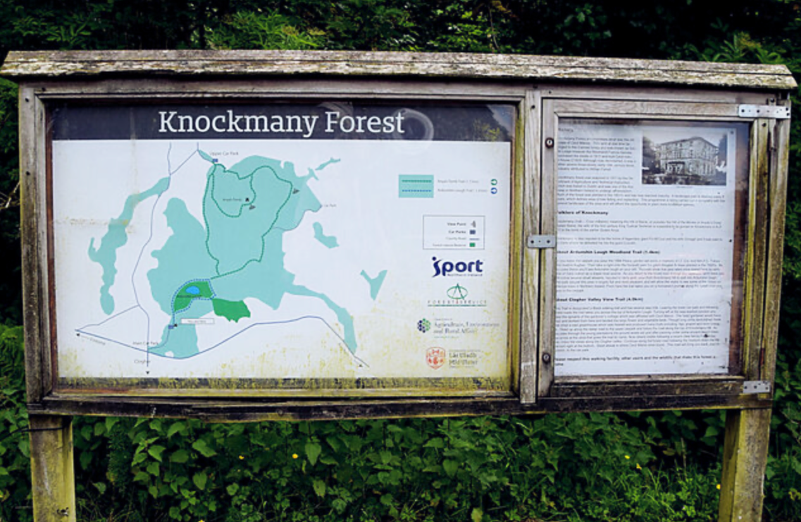

# An ideal Confluence
An ideal Confluence is:
- self navigable
- comprehensive
- not stale
- with good quality pages

This is of course, easier said than done. Even measuring these dimensions is not trivial 
when project scope, number of pages, spaces, and even domain varies between teams. 

Instead of outlining content goals, we'll outline here *structural* goals for an ideal 
Confluence.  

## Breaking out of single parent hierarchy makes navigation more intuitive

Typical Confluence instances rely on a single parent hierarchy of pages, but knowledge 
doesn't work like that. Yes, we can force anything into such a graph using the Dewey-Decimal 
system, but any bit of knowledge more naturally is structured as belonging to a set of 
overlapping categories. For example, the RS-25 rocket shuttle engines on Wikipedia are under 
the categories of 'space shuttle program,' 'rocket engines,' 'space launch system', 'rocket 
engines using the staged combustion cycle,' and still others.  

Wikipedia uses *categories*, but in Confluence the closest analogue I've found is the use 
of *labels*. With ccandle, you can use a finely-tuned search via sql query, then bulk edit 
labels. 

## Wikipedia-style navboxes guide readers along a topic

Wikipedia has over 7 million articles on its English encyclopedia. Nowhere will you find a 
Confluence-style page tree. One structural feature Wikipedia leverages to improve self-
navigability is *navboxes*. These are a kind of template page element with a set of curated 
links on a topic. Why should a user search like a lotto machine for a topic, when you can 
hold their hand and guide them through its most important pages, with a navbox?

Our approach to recreate this in Confluence is with the use of an *excerpt*
(reusable across pages) having a *filter by label* widget inside. This excerpt can then be 
'included' into other pages via an *excerpt-include* widget. 

To help you get started leveraging navboxes in your documentation, ccandle provides a 
bulk workflow for clearing and inserting navbox excerpts from a given page, along with 
tracking which pages in your corpus are navbox *sources* vs *consumers*.

## Better leading paragraphs make 'near misses' recoverable

For most Confluence users, they have two ways to navigate:
- hunt through the page tree
- pull the lever on the 'slot machine' of search

Good quality leading paragraphs make that second one, the slot machine, a little more 
effective. If finding info requires finding the exact needle in a haystack, via keyword 
search, there's a lot of effort involved in searching. Additionally, if there's no 
introductory paragraph in a page at all, it's often the case that a reader jumping in from 
a search needs to scan the page to determine if the info they seek is actually there. 

Good quality leading paragraphs include:
- a description of the page topic
- a few (3 or more, if possible) links to other pages in the topic

With these two basic things, finding info by 'search lottery' has less friction. With a 
decent *description*, readers quickly know if they're on a useful page for them. With a 
few links, they can correct *near misses*, finding a page that might take them closer to 
the info they seek.

ccandle can [automatically check and evaluate](what_does_ccandle_do.md) which pages have 
'good quality' introductions, and you can track the growth of the share of pages with good 
intros.

## Landing pages streamline navigation

Landing pages aka directories serve not so much as content as *structure*. Large networks 
are easier to navigate when they have a 'small world' effect: dense connections between 
pages in the same neighborhood, with a few 'hub' pages that connect neighborhoods together. 
The role of a landing page is for users to land on them, and quickly navigate away to 
another page. For an architecture wiki, a 'getting started' page might include some hotlinks 
to design docs, a repo, feature descriptions, coding guidelines, and tooling information.

Such landing / directory pages don't serve to inform readers of new information, instead 
being an easy to find starting point. Instead of requiring each user to maintain folders of 
bookmarks, landing pages serve to similarly keep important pages indexed and handy, easy to 
find for now or the future.

ccandle can help you identify landing pages with its page typing feature, built into its 
[processing pipeline](how_does_ccandle_work.md), and get an overview on the structural 
navigability of your tracked Confluence spaces.

## Canonical introductory pages put an entire overview in one place 

Canon intros serve as a hub by topic. Their job is to give a quick overview on the topic, 
linking to every relevant, authoritative page on that topic. These are not about writing 
a lot of new content, but instead to *gather all existing* relevant content in one place. 
This seems obvious, but it's often not practiced in organizations I've seen.

Having canon intros has the added benefit of making auditing staleness / outdatedness of 
pages easier. If they're all in one place, it's easier to update them all, when a new 
decision is made and a dozen pages need to be updated.

ccandle includes a trained page classifier to help you identify and track your canon intro 
pages. A little goes a long way! Even one in 30 pages already makes it easier for readers 
to find the info they need, instead of having to ping colleagues again and again for some 
esoteric design decision.
