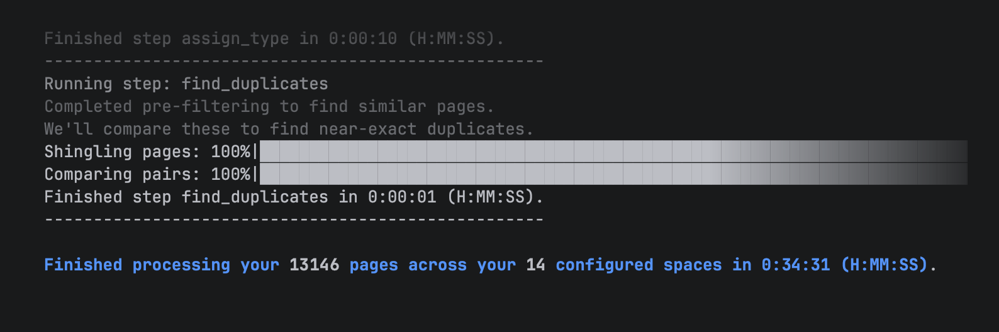

# How does ccandle work?

## Taking your docs offline allows far finer control and analysis
Confluence Cloud is awesome and has many features for collaboration...but it is opaque when 
it comes to some kinds of information. Therefore, ccandle's approach is not to constantly 
hit Confluence's REST APIs for every little analysis. That would neither be performant, nor 
allow for much value-added analysis. 

Instead, ccandle scrapes an offline copy of the Confluence spaces you want to track (add a 
few using `ccandle spaces add SPACE_ID ALIAS`), and keeps your local up to date with `ccandle 
sync`. While a fresh sync of 10K pages may take around 30 minutes (many API calls), syncing 
again a short time later (next day, week, month) only scrapes the delta (what's changed), so 
it only takes around 5 minutes. 

## Processing page htmls allows ccandle to add valuable metadata
After scraping page metadata and htmls, ccandle processes these pages, enhancing them metadata. 
It derives:
- page children relationships
- author / editor history (squashed to what's interesting)
- label information for each page
- plain text from page htmls
- basic statistics (link count, word count, etc.)
- page links and network relationships
- excerpt and navbox info
- page type based on random forest classification on training data
- which pages are duplicates of each other in your corpus

The full schema of what's stored in the pages table can be found by running `ccandle sql columns`

## Local pages table with metadata enables fast statistics and analysis
We frontload most heavy processing work into the processing pipeline, part of `sync`. This means 
most stats, clustering, etc. are then just lookups in sql. This also means you as a power user 
have fine grained information about pages, and can get very targeted lists of page ids to then 
pass into actions like [bulk label editing or navbox management](what_does_ccandle_do.md#taming-structure-by-managing-labels-and-navboxes-in-bulk).

And if you want to pump documentation into an LLM or RAG pipeline, you already have a local DB of 
pages...which also are already tagged by type. You can filter out administrative pages (meeting 
minutes, release notes, performance test results,...) so you can spare tokens on just the 
encyclopedic info your AI pipeline can actually use.

## Most functions are read only - only labels and excerpts management transform data in Confluence
The main point of ccandle is to give visibility into the quality and state of Confluence instances. 
Therefore, I've intentionally been careful not to introduce many create / update / delete operations, 
for safety's sake. Additionally, everything happens through your personal access token, so (assuming 
your org had reasonable access restrictions in place), your ccandle can only see the pages you can 
see in the Confluence Cloud web interface, and can only edit (labels and excerpts) pages you can.
