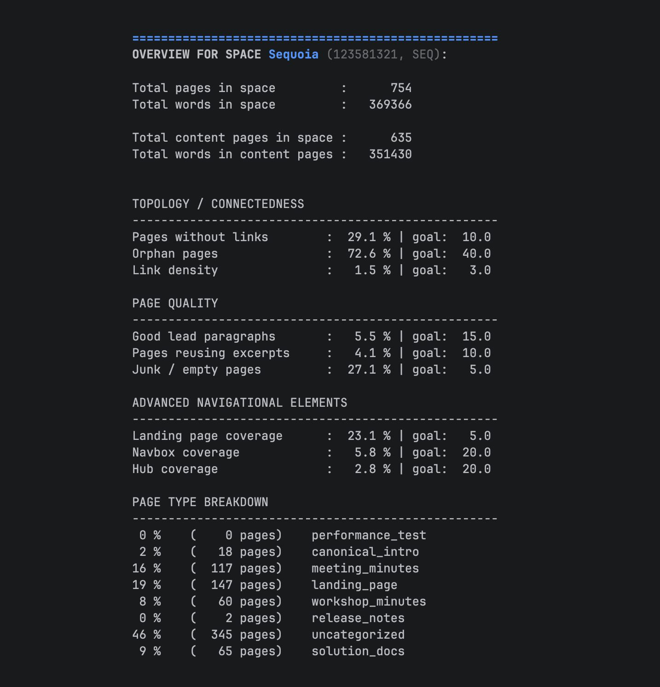
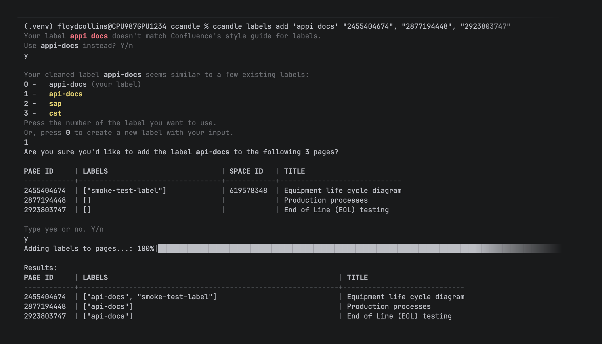
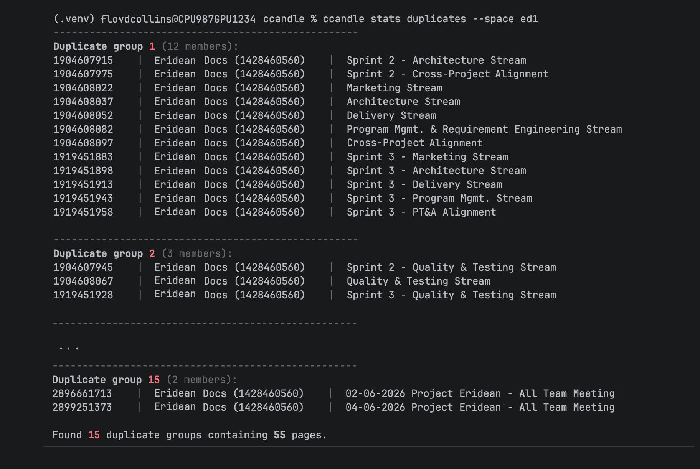
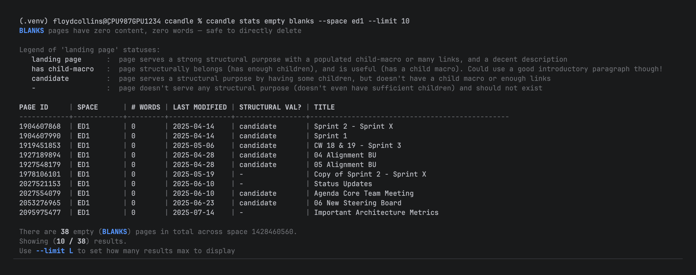

# ccandle gives you tools to manage larger Confluence spaces, or webs of spaces

## Measure Confluence quality with a single command

Run one command: `ccandle overview`, out pops data.

After scraping and processing your tracked Confluence spaces (`ccandle sync`), ccandle can 
generate an overview of your space quality across three dimensions:
- topology / connectedness
- page quality
- use of advanced navigational elements

By deterministically measuring your space quality, you get direct insight into where 
to focus maintenance efforts. You can also benchmark against old evaluations, to see 
if your maintenance efforts are outpacing the 'rot' that Confluence spaces tend towards.

### Why not measure content quality?
Well, without burning a lot of compute on a fancy LLM, measuring the content quality is 
just impossible for any reasonable deterministic algorithm. Even if you could throw around 
the compute to chuck a few hundred or thousand or tens of thousands of pages (yes, some 
teams rely on that much technical documentation) you'd need to give that LLM context about 
the project. Probably, that context comes from...the documentation you're processing. Of 
course, this becomes a bootstrapping problem.

Perhaps some future developer can tackle this issue. However, due to the mentioned 
difficulties, ccandle focuses on *form* and not content. 

## Taming structure by managing labels and navboxes in bulk
While outdated information and junk pages are a menace, often spaces are most in need 
of a more helpful structure. [Navboxes](docs/an_ideal_confluence.md#Wikipedia-style_navboxes_guide_readers_along_a_topic) 
are one structural element we can add to Confluence pages to give more structure; to 
*guide* readers to the next page in a topic. Creating trails requires work--but with 
ccandle, that work is faster:
1. *search* relevant pages in a topic / category is a bit easier with our sql queries (you can 
filter our rich metadata, and of course, ordinary keyword search). Nab their page IDs.
2. *label* pages with `ccandle labels LABEL_NAME PAGE_ID_LIST` in bulk. This updates pages 
via REST API.
3. insert *navboxes* into pages with `ccandle excerpts add NAV_SOURCE_PID TO_PAGE_ID_LIST` 

All of this could be done by hand, of course, but who wants to click four times each page 
to apply a label to dozens of pages? Who wants to insert a navbox 'excerpt', then forget 
what the source page was, and what the excerpt's name was? Work smarter, and faster.

## Rapidly identify junk -- and kill it before it rots your Confluence
Confluence Cloud doesn't allow deep inspection of space contents. Getting a list of empty 
pages isn't really possible. But leaving empty pages, or duplicate pages, clutters 
your page tree, your search results, and your Confluence.

run `ccandle stats duplicates` to get a list of pages that are functionally identical. 
In many spaces I've encountered, pages are created from a template, are *never* filled 
in, and at most have a date or name changed. With the *duplicates* feature, you can see 
which dupe groups exist, which spaces they belong to, and even set the sensitivity for 
how much is allowed to change for them to be considered duplicates.

run `ccandle stats empty` to get a list of pages that are, well, empty. Of course, 
pure word count doesn't always tell the full story. So you get to check for *blanks*, 
*wordless*, or *stubs* pages. You even get to preview if they have structural value: 
if they have children and are acting as useful folders, or are really just junk. Filter 
by last modified date if you're really risk avoidant, and kill only those pages so 
ancient no one will even notice they're gone.

