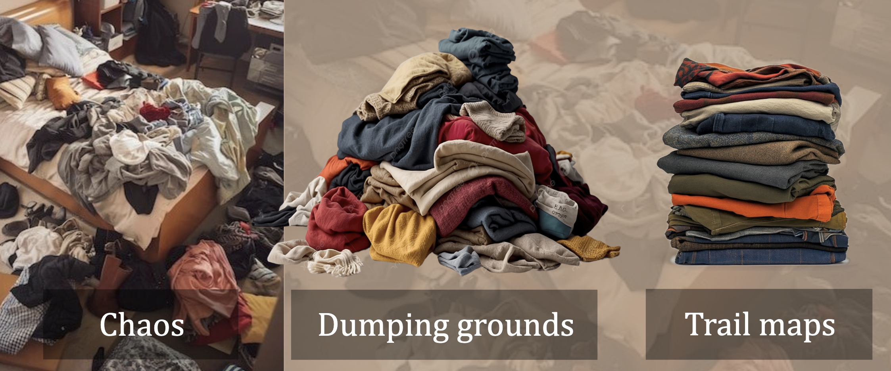

# Who is ccandle for?

ccandle is a set of tools for *power users* of Confluence: ones who:
- depend on / manage at least a few hundred pages on one or more Confluence spaces
- want insight into the health, quality, and navigability of their technical documentation
- want to track the impact of their management / improvement efforts across time
- need tools for making some changes (managing labels, excerpts and navboxes) in bulk, without 
clicking through a tedious UI for each page

## Who ccandle is not for
Unfortunately, not every organization is ready to use ccandle. Some orgs fragment their 
technical documentation across PowerPoint presentations, email chains, spreadsheets, SharePoint 
folders, and only sprinkle a little into their Confluence instances. Atlassian too, often laments
that this is often the case with organizations they support. 

A clothes folding machine can only help you to tidy up if all your clothes are in a pile. If 
they're scattered across closets and floors and hampers, the clothes first have to be collected 
together in one place, for the clothes folding machine to save any time.

Put all (or at least most!) of your technical docs together in one place: Confluence. If your 
organization hasn't managed that yet, you won't be able to get the most out of ccandle.